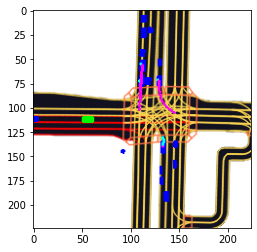
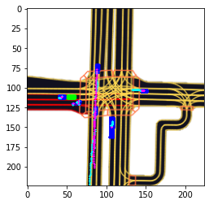
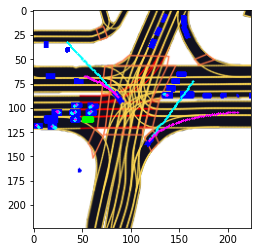
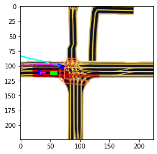

# a14av-project-motion-prediction
RBE 595 Speical Topics, Artificial Intelligence for Autonomous Vehicles course project

This is our final course project for Artificial Intelligence for Autonomous Vehicles.
Instructor: Carlos Morato

Submitted by: Aditya Jagani and Kishor Sabarish Ganapathy Subramanian

Some sample results are shown below:

Good Predictions

| | |
|:-------------------------:|:-------------------------:|
|  |  |

Bad Predictions
|  |  |
